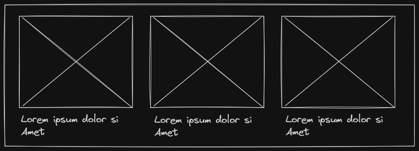

# @newsman/core

A framework to mine news articles from various outlets through a reliable and modular system, inspired by the [NewsAPI](https://newsapi.org)

- :newspaper: Sort news by language, country and domain
- :ok: Easily add or exclude sites by just deleting the corresponding files   
- :dragon: Customize the scraping behaviour through [DracoQL](https://github.com/aadv1k/DracoQL)


## Usage

```bash
npm install @newsman/core
```

```typescript
// Fetch the headlines from all news sources in India
const articles = await NewsMan.fetchHeadlines({
  countryCode: "in"
});

// Fetch the headlines from all news sources in India, excluding the 
// `ndtv.com` domain
const articles = await NewsMan.fetchHeadlines({
  countryCode: "in",
  excludeDomains: ["ndtv.com"]
});

// Fetch the headlines from the specified news sources in India, and 
// cache the results for 1 hour
const cache = new LocalCache(60 * 60 * 1000);

const articles = await NewsMan.fetchHeadlines({
  countryCode: "in",
}, cache);
```

### Output

This will return an array of `NewsArticle` which look like this

```typescript
[
  // ...
  {
    "title": "Mahua Moitra says want to 'cross-examine' Darshan Hiranandani, demands list of alleged gifts",
    "url": "https://hindustantimes.com//india-news/mahua-moitra-says-want-to-cross-examine-darshan-hiranandani-demands-list-of-alleged-gifts-101698399539637.html",
    "urlToImage": "https://www.hindustantimes.com/ht-img/img/2023/10/27/148x111/ANI-20230810024-0_1698399789548_1698399816949.jpg",
    "source": "hindustantimes.com",
    "description": "New Delhi: Trinamool Congress MP Mahua Moitra on Friday told the Ethics Committee of Lok Sabha that businessman Darshan Hiranandani's recent affidavit against her was “scant on detail and provides no actual inventory”... (truncated) [+530 chars]",
    "publishedAt": null
  }
  // ...
]
```


## How it Works

The system works by looping and parsing through a dir of `.dql` file, which corresponds to [DracoQL](https://github.com/aadv1k/DracoQL) query file. 

The query might look something like this, also you don't need to know DQL, it's really simple to read and understand.

```cql
VAR data = FETCH "https://www.india.com/" AS HTML

VAR d1 = EXTRACT ".top-news > div:nth-child(2)" FROM data
VAR d2 = EXTRACT "div.new-cat-listing:nth-child(8) > div:nth-child(2) > div:nth-child(2)" FROM data
```

Here the `data` variable stores the html for the retrieved site, and `d1` and `d2` correspond to a HTML container with children that look like this




> The variable names can be anything as long as there are some which hold some HTML data in them, `d1` and `d2` are just arbitrary names 

This is used to extract the image and the link to the article. We then visit that article to extract the `description`, `title`, `publishedAt` through a combination of regex and text clean-up .

## Customize

So you might want to add new sources, for now you can clone this repo and add it to the [`./dql/headlines`](./dql/headlines)

The file being added needs to be of a particular format for it to be recognized and run 

```
{Domain}_{Language}_{Country}.dql
```

```
ndtv.com_en_in.dql
```

The file itself needs to contain variables which extract HTML data from the source, it can be multiple variables since we loop through them.

```cql
VAR data = FETCH "https://www.ndtv.com/"
  AS HTML HEADLESS


VAR d1 = EXTRACT "#topstoriesdata > ul:nth-child(2)" FROM data
VAR d2 = EXTRACT ".latest_widget > ul:nth-child(2)" FROM data
```

You can omit the `HEADLESS` keyword if the site in-question works without one, this will save a ton on the memory.
